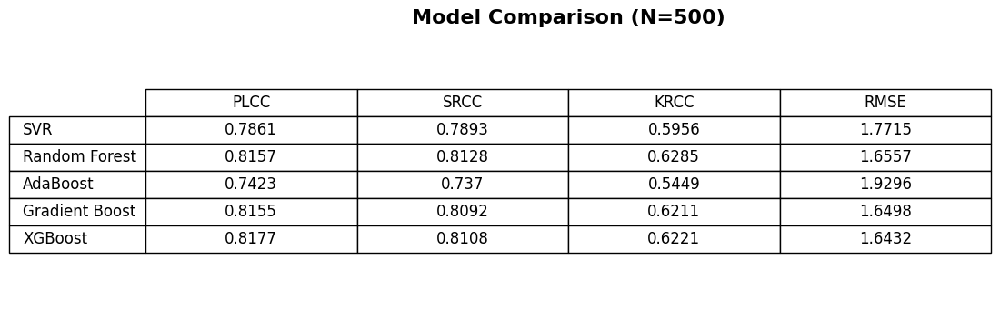
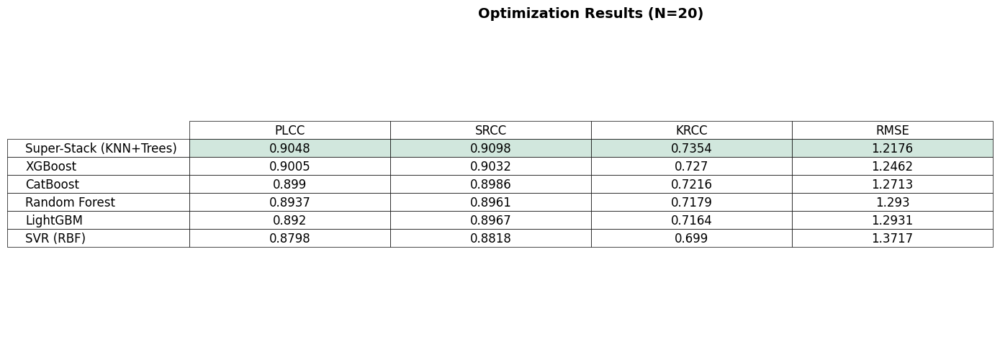

# UIQA-Feature-Extraction: No-Reference Underwater Image Quality Assessment

[]()
[]()
[]()
[]()

> **⚠️ Project Status: Ongoing**
> This repository is currently under active development as part of a research internship at IIT Indore. Code structures and model parameters are subject to optimization.

## 📌 Project Overview
This project focuses on developing a **No-Reference Image Quality Assessment (NR-IQA)** framework specifically for underwater imagery. Unlike standard metrics (PSNR/SSIM) that require reference images, this approach predicts perceptual quality using a hybrid feature extraction methodology.

**Key Methodology:**
1.  **Feature Extraction (MATLAB):** Extracts 25 statistical features (10 Structural + 15 Color) to capture underwater-specific degradations like absorption, scattering, and low contrast.
2.  **Machine Learning (Python):** Utilizes a Super Stack Ensemble model to map these features to human perceptual scores (MOS).

## 📂 Repository Structure
```text
UIQA-Feature-Extraction-IIT-Indore/
│
├── feature_extraction/            # MATLAB scripts for feature generation
│   ├── generate_feature_files.m   # Main execution script
│   └── feature_extract.m          # Core function (25-feature vector logic)
│
├── model_development/             # Jupyter Notebooks for training
│   ├── 01_Base_Models_SVR.ipynb   # Baseline SVR implementation
│   └── 02_Super_Stack_Model.ipynb # High-performance Ensemble model
│
├── datasets/                      # Raw images and MOS Excel sheets
├── features/                      # Extracted .mat feature files
├── results/                       # Performance plots and metrics
└── reports/                       # Task documentation and theory
```
## 🚀 Usage & Reproduction Guide

### Phase 1: Feature Extraction (MATLAB)
*Prerequisite: MATLAB installed.*

1.  Navigate to the `feature_extraction/` folder.
2.  Open `generate_feature_files.m`.
3.  Set your dataset path (ensure `datasets/SUAD` and `datasets/UID` contain images).
4.  Run the script.
    * **Output:** This will generate individual `.mat` files for every image in the `features/` directory.

### Phase 2: Model Training (Python / Google Colab)
*Prerequisite: The Notebooks are designed to run in a cloud environment (like Google Colab) or local Jupyter Lab.*

**Step 1: Prepare your Data**
Before running the notebooks, ensure you have these three specific files ready:
1.  **`features.zip`**: Compress the `features/` folder (containing all `.mat` files) into a single zip file.
2.  **`mos_UID.xlsx`**: The ground truth Mean Opinion Scores for the UID dataset.
3.  **`SAUD_MOS.xlsx`**: The ground truth Mean Opinion Scores for the SUAD dataset.

**Step 2: Runtime Setup**
1.  Open `model_development/02_Super_Stack_Model.ipynb`.
2.  **Upload to Runtime:**
    * If using Google Colab, drag and drop `features.zip`, `mos_UID.xlsx`, and `SAUD_MOS.xlsx` into the file browser on the left.
3.  **Run the Notebook:**
    * Run the cells to train the regression models.

## 🏆 Current Results
We have achieved state-of-the-art correlation with human perception using a stacking ensemble approach.

| Model | PLCC (Accuracy) | SROCC (Monotonicity) |
| :--- | :---: | :---: |
| **Baseline (SVR)** | 0.7861 | 0.7893 |
| **Super Stack Model** | **0.9048** | **0.9098** |

> *Note: The Super Stack model achieved this with limited iterations (20) due to computational constraints. Further tuning is expected to improve results.*

### Performance Visuals
| SVR Performance | Stack Model Performance |
|:---:|:---:|
|  |  |
| *Moderate correlation (PLCC ~0.78)* | *High correlation (PLCC ~0.90)* |

## 📄 Dataset Details
The framework is validated on a consolidated dataset of **1,960 images**:
* **SUAD:** 1,000 Images (Diverse underwater scenes)
* **UID:** 960 Images (Reference-graded underwater database)

## 📑 Documentation
Detailed reports on the internship tasks and theoretical background can be found in the [`reports/`](reports/) directory:
* [Task 1: UIQA Basics](Reports/Task_1_UIQA_Basics.pdf)
* [Task 2: Feature Logic](Reports/Task_2_Feature_Logic.pdf)

---
*Maintained by Sriram Dhanasekaran | IIT Indore Internship | Dec 2025 - Present*
